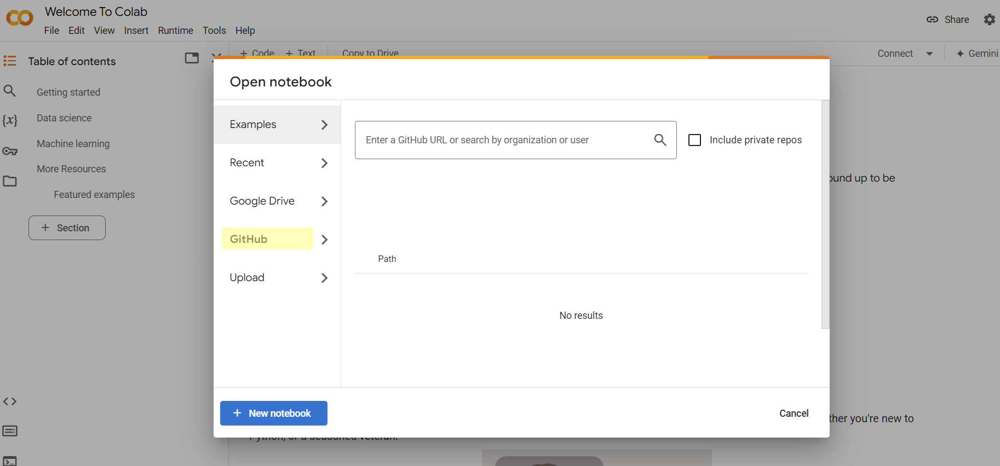

Install Python Environment
---------------------------

Local Environment
^^^^^^^^^^^^^^^^^^
1. Download and install the latest `Anaconda <https://docs.conda.io/projects/conda/en/latest/user-guide/install/linux.html>`_ distribution:

.. code-block:: bash

    wget https://repo.anaconda.com/archive/Anaconda3-2024.06-1-Linux-x86_64.sh
    ./Anaconda3-2024.06-1-Linux-x86_64.sh

2. Create a new ``conda`` virtual environment for this tutorial notebooks and install dependecy packages:

.. code-block:: bash

    conda create -n tutorial python=3.10
    pip install -r requirements.txt
    conda activate tutorial

3. ``requirement.txt`` contains the following packages:

.. include:: ../../_static/requirements.txt
    :literal:

Cloud Environment
^^^^^^^^^^^^^^^^^^
1. Binder

.. image:: https://mybinder.org/badge_logo.svg
    :target: https://mybinder.org/v2/gh/MingyiXue/deep-learning-for-bioinformatics-101/develop?labpath=code

2. Google Colab

Open notebooks in ``Colab`` from GitHub links, and download or install denpendencies adead of existing code blocks if necessary:

